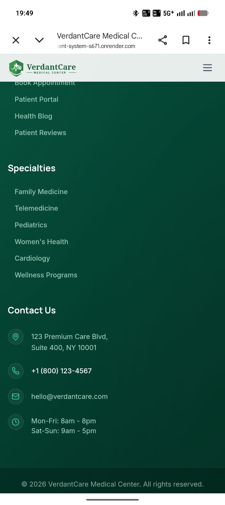

# VerdantCare Medical Center

A full-stack healthcare management system built with the MERN stack (MongoDB, Express, React, Node.js). Features patient appointments, telehealth video calls, billing, prescriptions, and role-based portals for patients, doctors, and administrators.

**Live:** [healthcare-management-system-s671.onrender.com](https://healthcare-management-system-s671.onrender.com)

---

## Features

### Patient Portal
- Book, view, and cancel appointments
- Video consultations (WebRTC)
- Medical records & prescriptions
- Billing & invoice management (Razorpay + Stripe)
- Insurance information
- Notifications & messaging
- Profile management

### Doctor Portal
- Appointment schedule management
- Patient list & consultation history
- Create prescriptions
- Video consultations
- Availability & time-off management

### Admin Portal
- Dashboard with analytics & reports
- Doctor & patient management
- Appointment oversight
- Billing & revenue tracking
- Blog & review moderation
- Platform settings & branding (logo upload)
- Audit logs
- User role management

### Public Pages
- Homepage, About, Services, Doctors directory
- Blog, Reviews (public, no auth required), FAQ
- Contact form, Careers, Privacy Policy, Terms

---

## Tech Stack

| Layer | Technology |
|-------|-----------|
| Frontend | React 18, Vite, Tailwind CSS, React Query, Redux Toolkit, React Router |
| Backend | Node.js, Express, Mongoose (MongoDB) |
| Real-time | Socket.io (notifications, WebRTC signaling) |
| Video | WebRTC (RTCPeerConnection + STUN) |
| Auth | JWT (access + refresh tokens), bcryptjs, Google OAuth |
| Payments | Razorpay + Stripe |
| File Upload | Multer + Cloudinary |
| Email | Nodemailer (Brevo SMTP) |
| Deployment | Render (single-service, Node runtime) |
| Database | MongoDB Atlas |

---

## Project Structure

```
── client/                  # React frontend (Vite)
│   ├── src/
│   │   ├── api/             # Axios API clients
│   │   ├── components/      # Shared UI components
│   │   ├── features/        # Feature modules (admin, patient, doctor, public, auth, telehealth)
│   │   ├── hooks/           # Custom React hooks
│   │   ├── layouts/         # DashboardLayout, PublicLayout
│   │   ├── store/           # Redux store (auth, UI slices)
│   │   └── utils/           # Helpers
│   └── vit

e.config.js
├── server/                  # Express API backend
│   ├── src/
│   │   ├── config/          # DB, Socket.io, Cloudinary, Stripe, Razorpay
│   │   ├── controllers/     # Route handlers
│   │   ├── middleware/       # Auth, validation, upload, rate limiting
│   │   ├── models/          # Mongoose schemas
│   │   ├── routes/          # Express routers
│   │   ├── seeds/           # Database seeder
│   │   ── utils/           # Email, logger, PDF, tokens
│   └── package.json
├── build.js                 # Build script for Render deployment
└── render.yaml              # Render service config
```

---

## Getting Started

### Prerequisites
- Node.js 18+
- MongoDB Atlas cluster (or local MongoDB)
- Cloudinary account (for logo/file uploads)
- Brevo account (for email)
- Razorpay + Stripe accounts (for payments)

### Environment Variables

**Server (`server/.env`):**
```env
MONGODB_URI=mongodb+srv://...
JWT_SECRET=your_jwt_secret
JWT_REFRESH_SECRET=your_refresh_secret
PORT=5000
CLOUDINARY_CLOUD_NAME=...
CLOUDINARY_API_KEY=...
CLOUDINARY_API_SECRET=...
SMTP_HOST=smtp-relay.brevo.com
SMTP_PORT=587
SMTP_USER=...
SMTP_PASS=...
RAZORPAY_KEY_ID=...
RAZORPAY_KEY_SECRET=...
STRIPE_SECRET_KEY=...
STRIPE_WEBHOOK_SECRET=...
```

**Client (`client/.env`):**
```env
VITE_API_URL=/api
VITE_GOOGLE_CLIENT_ID=...
```

### Local Development

```bash
# Install dependencies
npm install
cd client && npm install
cd ../server && npm install

# Seed database (optional)
cd server && npm run seed

# Start backend (port 5000)
cd server && npm run dev

# Start frontend (port 5173)
cd client && npm run dev
```

### Production Build

```bash
node build.js
```

---

## Default Credentials (after seeding)

| Role | Email | Password |
|------|-------|----------|
| Admin | admin@verdantcare.com | Admin@123 |
| Receptionist | reception@verdantcare.com | Admin@123 |
| Billing Staff | billing@verdantcare.com | Admin@123 |
| Content Manager | content@verdantcare.com | Admin@123 |

---

## Deployment

Deployed on **Render** as a single web service:
- **Build command:** `node build.js`
- **Start command:** `npm start`
- Serves both the Express API and the built React client from `client/dist`

---

## License

MIT
